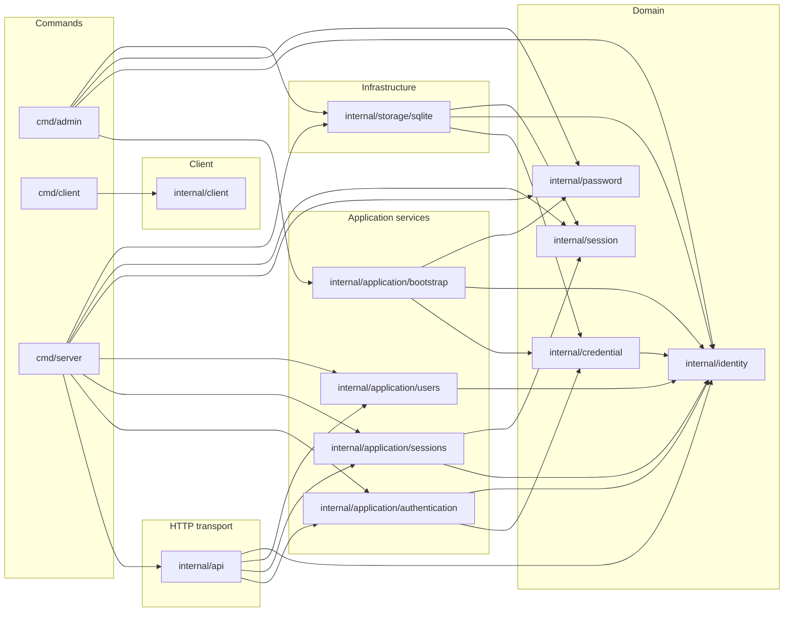

<!-- Code generated by go run ./tools/archdoc; DO NOT EDIT. -->

# Architecture overview

This page describes the production packages in `github.com/ebe542/go-mediaarchive`. It is generated from the package metadata returned by `go list -json ./...`.

Regenerate it after changing package boundaries or imports:

```bash
go run ./tools/archdoc -output docs/architecture.md
```

## Related documentation

- [Database structure](database.md)

## Package dependencies

An arrow from package A to package B means that A imports B. External and standard-library packages are intentionally omitted.



## Modules

| Package | Layer | Package documentation |
| --- | --- | --- |
| [`cmd/admin`](../cmd/admin) | Commands | Not documented yet. |
| [`cmd/client`](../cmd/client) | Commands | Not documented yet. |
| [`cmd/server`](../cmd/server) | Commands | Not documented yet. |
| [`internal/api`](../internal/api) | HTTP transport | Not documented yet. |
| [`internal/application/authentication`](../internal/application/authentication) | Application services | Package authentication verifies user credentials. |
| [`internal/application/bootstrap`](../internal/application/bootstrap) | Application services | Package bootstrap coordinates initial administrator creation. |
| [`internal/application/sessions`](../internal/application/sessions) | Application services | Package sessions coordinates authenticated server-side sessions. |
| [`internal/application/users`](../internal/application/users) | Application services | Package users coordinates user identity application operations. |
| [`internal/client`](../internal/client) | Client | Not documented yet. |
| [`internal/credential`](../internal/credential) | Domain | Package credential defines authentication credentials independently of users. |
| [`internal/identity`](../internal/identity) | Domain | Package identity defines users and global security roles. |
| [`internal/password`](../internal/password) | Domain | Package password provides password hashing and verification. |
| [`internal/session`](../internal/session) | Domain | Package session defines opaque server-side authentication sessions. |
| [`internal/storage/sqlite`](../internal/storage/sqlite) | Infrastructure | Package sqlite provides SQLite persistence for Media Archive. |
