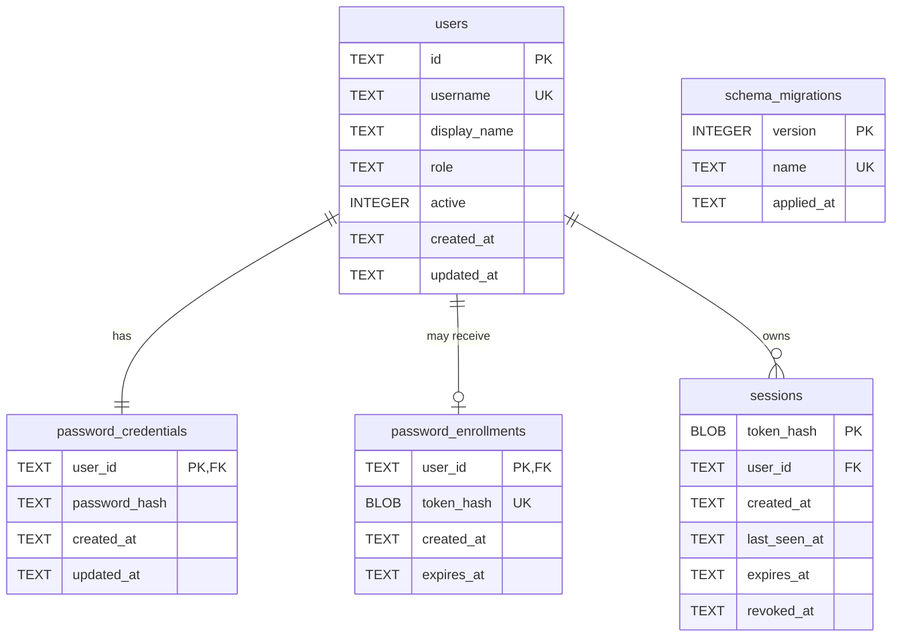

# Database structure

Media Archive stores authentication and user metadata in SQLite. The embedded
SQL migrations in [`internal/storage/sqlite/migrations`](../internal/storage/sqlite/migrations)
are the authoritative schema definition. This document provides a readable
overview of the current schema after all migrations have been applied.

## Entity relationships

The migration ledger is intentionally independent of the domain tables. It
records which embedded migrations have already been applied.

## Tables

### `schema_migrations`

Created by the migration runner before embedded migrations are applied.

| Column | SQLite type | Rules | Purpose |
| --- | --- | --- | --- |
| `version` | `INTEGER` | Primary key | Numeric migration order. |
| `name` | `TEXT` | Not null, unique | Embedded migration filename. |
| `applied_at` | `TEXT` | Not null, generated default | UTC timestamp recorded by SQLite when the migration succeeds. |

Each migration runs in a transaction. Its ledger entry is inserted in that
same transaction, so a failed migration does not appear as applied.

### `users`

Stores user identity, display information, global role, and activation state.

| Column | SQLite type | Rules | Purpose |
| --- | --- | --- | --- |
| `id` | `TEXT` | Primary key; lowercase UUID shape | Stable user identifier. |
| `username` | `TEXT COLLATE NOCASE` | Not null, unique; 3-32 normalized characters | Case-insensitive login name containing lowercase letters, digits, `_`, or `-`. |
| `display_name` | `TEXT` | Not null; trimmed length 1-100 | Human-readable name. |
| `role` | `TEXT` | Not null; `viewer`, `editor`, or `admin` | Global authorization role. |
| `active` | `INTEGER` | Not null; `0` or `1`; default `1` | Whether authentication and protected operations are allowed. |
| `created_at` | `TEXT` | Not null, non-empty | Creation time in RFC 3339 Nano format. |
| `updated_at` | `TEXT` | Not null, non-empty | Last update time in RFC 3339 Nano format. |

The table is `STRICT`, so SQLite rejects values whose storage class is not
compatible with the declared column type.

### `password_credentials`

Separates password authentication data from the user identity record.

| Column | SQLite type | Rules | Purpose |
| --- | --- | --- | --- |
| `user_id` | `TEXT` | Primary and foreign key to `users.id` | Enforces at most one password credential per user. |
| `password_hash` | `TEXT` | Not null; must start with `$argon2id$` | Stores an encoded Argon2id hash, never a plaintext password. |
| `created_at` | `TEXT` | Not null, non-empty | Credential creation time in RFC 3339 Nano format. |
| `updated_at` | `TEXT` | Not null, non-empty | Last credential update time in RFC 3339 Nano format. |

Updates and deletes of the referenced user ID are restricted. Credential
lifecycle operations must therefore be explicit instead of silently cascading.

### `sessions`

Stores server-side authentication session metadata.

| Column | SQLite type | Rules | Purpose |
| --- | --- | --- | --- |
| `token_hash` | `BLOB` | Primary key; exactly 32 bytes | SHA-256 hash used to resolve a bearer token without persisting the token itself. |
| `user_id` | `TEXT` | Not null; foreign key to `users.id` | Owner of the session. |
| `created_at` | `TEXT` | Not null, non-empty | Session creation time in RFC 3339 Nano format. |
| `last_seen_at` | `TEXT` | Not null; between creation and expiration | Time of the latest accepted use. |
| `expires_at` | `TEXT` | Not null; later than creation | Absolute session expiration time. |
| `revoked_at` | `TEXT` | Nullable; non-empty when present | Revocation time; `NULL` means the session has not been revoked. |

`sessions_user_id_index` accelerates lookups of all sessions belonging to one
user. User ID updates and deletes are restricted while sessions reference the
user.

### `password_enrollments`

Stores at most one current initial-password enrollment for a user who does not
yet have a password credential.

| Column | SQLite type | Rules | Purpose |
| --- | --- | --- | --- |
| `user_id` | `TEXT` | Primary and foreign key to `users.id` | Ensures at most one current enrollment per user. |
| `token_hash` | `BLOB` | Not null, unique, exactly 32 bytes | SHA-256 hash used to resolve a presented one-time token. |
| `created_at` | `TEXT` | Not null, non-empty | Enrollment issue time in RFC 3339 Nano format. |
| `expires_at` | `TEXT` | Not null; later than creation | Absolute expiration time. |

Saving another enrollment for the same user atomically replaces the token hash
and timestamps, immediately invalidating the previous token. Enrollment is
rejected when the user already has a password credential. Token consumption
and initial credential creation share one transaction, so neither change can
be committed independently. The `password_enrollments_expires_at_index`
supports later cleanup of expired records.

## Storage and integrity rules

- Domain tables use SQLite `STRICT` mode.
- Foreign-key enforcement is enabled for every database connection.
- Repository timestamps use `time.RFC3339Nano`; session ordering constraints
  compare their canonical textual representation.
- Passwords are represented only by encoded Argon2id hashes.
- Session bearer tokens are returned to the client once, while only their
  32-byte SHA-256 hashes are persisted.
- Password enrollment tokens follow the same one-time plaintext and persisted
  SHA-256-hash separation.
- Global roles do not represent permissions to download licensed media. Those
  permissions require a separate media authorization model.

## Migration history

| Version | Migration | Result |
| --- | --- | --- |
| `001` | [`001_initialize.sql`](../internal/storage/sqlite/migrations/001_initialize.sql) | Initializes the migration sequence without creating domain tables. |
| `002` | [`002_create_users.sql`](../internal/storage/sqlite/migrations/002_create_users.sql) | Creates `users`. |
| `003` | [`003_create_password_credentials.sql`](../internal/storage/sqlite/migrations/003_create_password_credentials.sql) | Creates `password_credentials` and its user relationship. |
| `004` | [`004_create_sessions.sql`](../internal/storage/sqlite/migrations/004_create_sessions.sql) | Creates `sessions` and `sessions_user_id_index`. |
| `005` | [`005_create_password_enrollments.sql`](../internal/storage/sqlite/migrations/005_create_password_enrollments.sql) | Creates replaceable, expiring password enrollments. |

New schema changes must be added as a new zero-padded migration. Existing
migrations must remain immutable after publication because deployed databases
may already have recorded them as applied.
